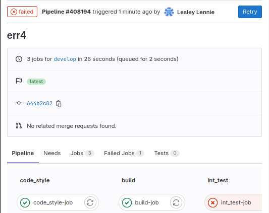
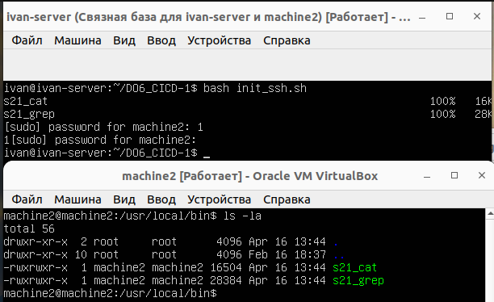

# DO6_CICD-1

## Part 1. Настройка gitlab-runner

Поднимем виртуальную машину `Ubuntu Server 22.04 LTS`.

*Виртуальная машина*

Скачаем и установим на виртуальную машину `gitlab-runner`. Для этого добавим официальный репозиторий gitlab Runner `curl -L https://packages.gitlab.com/install/repositories/runner/gitlab-runner/script.deb.sh | sudo bash`

*Добавленный репозиторий*

Теперь установим gitlab runner

*Установленный gitlab-runner*

Зарегистрируем `gitlab-runner` для использования в текущем проекте.

*Регистрация gitlab-runner*

## Part 2. Сборка

Напишем этап для `CI` по сборке приложений из проекта `C2_SimpleBashUtils`.

В файле `gitlab-ci.yml` добавим этап запуска сборки через мейк файл из проекта `C2`.

*Файл .gitlab-runner*

*Содержимое init_make*

Файлы, полученные после сборки (артефакты), будут храниться в течении 30 дней.

На вкладке `'Jobs'` в `'GitLab'` удостоверимся, что проект собирается без ошибок.

*Отчет о сборке в GitLab*

## Part 3. Тест кодстайла

Напишем этап для `CI`, который запускает скрипт кодстайла `(clang-format)`.

*Этап code-style для CI*

Скрипты для проверки `cat` и `grep` имеют вид:

*Скрипт для cat*

*Скрипт для grep*

Проверим стадию `code_style` для уже отформатированного кода

*Pipeline при отформатированном коде*

*Вывод стадии code_style*

Сделаем стилистическую ошибку в `s21_grep.c` и если кодстайл не пройдет, то «зафейлим» пайплайн.

*Pipeline при неотформатированном коде*

*Вывод стадии code_style*

Исправим ошибку и продолжим работу.

## Part 4. Интеграционные тесты

Напишем этап для `CI`, который запускает интеграционные тесты из того же проекта.

*Этап запуска инеграционных тестов*

*Блок my_test.sh для cat,ответственный за код возврата*

*Блок my_test_grep.sh, ответственный за код возврата*

Так как я писал `grep` для `MacOS`, а сейчас запускаю тесты и grep на `Ubuntu`, то часть тестов работает некорректно (188 тестов).Делаем корректировку ответа (уменьшаем количество фейлов на количество сломанных тестов)

Запустим `CI` без ошибок в тестах

*Pipline без ошибок в тестах*

*Вывод этапа интеграционных тестов*

Запустим `CI` без поправки на сломанные тесты

*Отмена поправок в my_test_grep*

*Pipline c ошибками в тестах*

*Вывод этапа интеграционных тестов c ошибками*

Вернем поправку и продолжим работу.

## Part 5. Этап деплоя

Поднимем вторую виртуальную машину Ubuntu `Server 22.04 LTS`.

*Связанная копия машины ivan-server, названная machine2*

Напишем этап для `CD`, который «разворачивает» проект на другой виртуальной машине.

*Этап CD в .gitlab-ci.yml*

Напишем bash-скрипт, который при помощи `ssh` и `scp` копирует файлы, полученные после сборки (артефакты), в директорию `/usr/local/bin` второй виртуальной машины.

*Содержимое скрипта init_ssh.sh*

Дадим права каталогу `/usr/local/bin` c помощью команды `sudo chmod 777 /usr/local/bin`

Настроем локальную сеть на машинах `ivan-server` и `machine2`:

*Настройка конфигураций сети на машинах ivan-server и machine2*

Сгенерируем ключ с помощью `ssh-keygen` на машине `ivan-server` и перешлем его на `machine2` с помощью команды `ssh-copy-id machine2@10.0.2.3`. Далее запустим скрипт и проверим, перенесутся ли объектные файлы в `usr/local/bin` на машине `machine2`

*Проверка работоспособности скрипта*

Удалим ключ пользователя `ivan` и сгенерируем ключи для `root` и `gitlab-runner` пользователей и прокинем их на `machine2`, чтобы эти пользователи имели возможность подключаться к `machine2`

*Авторизованные ключи на machine2*

Проверим, как работает написанный нами `gitlab-ci.yml`. Запустим `pipeline`.

*Ожидание ручного запуска стадии `deploy`*

Запусти этап `deploy` и посмотрим итоговый pipeline

*Результаты CI/CD*

В случае ошибки пайплайн фейлится

*Зафейленный pipeline*

## Part 6. Дополнительно. Уведомления

Настроим уведомления о успешном/неуспешном выполнении пайплайна через бота. Для начала, отправим сообщение `@BotFather` в Telegram, чтобы зарегистрировать своего бота и получить токен аутентификации.

*Созданный бот*

 
 Далее напишем скрипт `telegram.sh`, который будет пересылать через бота состояние пайплайна и его стадий

*Содержимое telegram.sh*

Добавим в `.gitlab-ci.yml` поле `after_script` и поместим туда написанный скрипт

*Добавленные поля*

Уведомления должны содержать информацию об успешности прохождения как этапа **CI**, так и этапа **CD**. Проверим

*Вывод бота при успешном pipline*

*Вывод бота при зафейленном pipline*

