# DO1 Linux-1 lesleyle

## Part 1. Установка ОС

**1.1 Выведем команду для определения версии убунту**

```
cat /etc/issue
```

<div align="center">

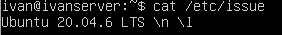
</div>
<center>*Версия Убунту*</center>

## Part 2. Создание пользователя

**2.1 Вызывем команду для создания пользователя и добавление его в группу adm**

<div align="center">


<center>*Команда добавления пользователя в группу adm*</center>
</div>
  
**2.2 Выведем команду для проверки создания пользователя**

```
cat /etc/passwd
```

<div align="center">


<center>*Добавленный пользователь*</center>
</div>

**2.3 Назначим пароль новому пользователю**

<div align="center">

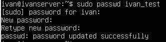
<center>*Смена пароля*</center></div>

## Part 3. Настройка сети ОС

**3.1 Зададим название машины вида user-1 в настройках VirtualBox:**

<div align="center">

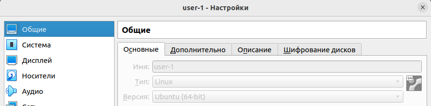
<center>*Задаем виртуальной машине имя*</center></div>

**3.2 Установим временную зону командой** 

```
sudo timedatectl set-timezone "Europe/Moscow"
```

**3.3 Выведем названия сетевых интерфейсов с помощью консольной команды**

```
ip link
```
<div align="center">

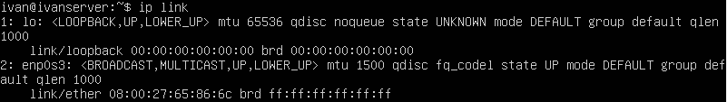
<center>*Сетевые интерфейсы*</center></div>

Где:

``lo (или loopback)`` - это специальный сетевой интерфейс, который используется для тестирования сетевых приложений и протоколов, а также для локальной передачи данных между приложениями на одном и том же компьютере

``enpQs3`` - это имя сетевого интерфейса, которое обычно используется в системах на базе Linux для обозначения физического сетевого устройства, подключенного к одному из портов PCI Express (PCIe).

**3.4 Определим ip адрес устройства, на котором мы работаем, от DHCP сервера.**

```
sudo dhclient -v
```
<div align="center">

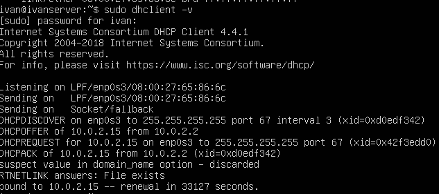
<center>*Получение ip адреса от DHCP сервера*</center></div>

``DHCP (Dynamic Host Configuration Protocol)``- это сетевой протокол, который автоматически назначает IP-адреса и другие параметры сети клиентам в сети. DHCP-сервер предоставляет клиентам необходимую информацию для подключения к сети, включая IP-адрес, маску подсети, шлюз по умолчанию и адреса DNS-серверов.

**3.5 Определ внешний ip-адрес шлюза (ip):**

```
curl ifconfig.me
```
<div align="center">

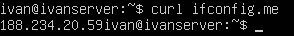
<center>*Внешний ip адрес*</center></div>

**3.6 Найдем внутренний IP-адрес шлюза, он же ip-адрес по умолчанию (gw)**

```
ip route | grep default
```
<div align="center">

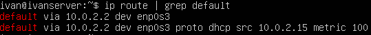
<center>*Внутренний ip адрес*</center></div>

``10.0.2.2`` - это IP-адрес шлюза (gateway), который используется для передачи пакетов в Интернет. Шлюз выступает в роли посредника между локальной сетью и внешней сетью, обеспечивая соединение между ними.

``10.0.2.15`` - это IP-адрес устройства, с которого отправляются пакеты. Этот IP-адрес назначается устройству, которое подключено к локальной сети, и используется для идентификации устройства в сети.

**3.7 Настройка IP-адреса, шлюза (gateway) и DNS-сервера**

Перейдем в папку с файлом конфигурации сетевого интерфейса

```
sudo nano /etc/netplan/
```

и отредактируем его

<div align="center">

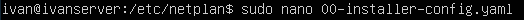
<center>*Открытие файла конфигурации сетевого интерфейса*</center></div>

<div align="center">

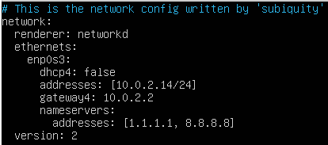
<center>*Отредактированный файл конфигурации сетевого оборудования*</center></div>

**3.8 Применим новые настройки сети с помощью команды:**

```
sudo netplan apply
```
**3.9 Проверим ip адрес с помощью команды:** 

```
ip a
```

<div align="center">

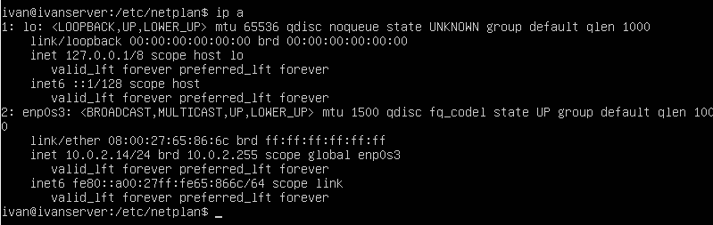
<center>*Новый ip совпадает с выставленным ранее*</center></div>

**3.10 Узнаем новый шлюз:**

```
ip r
```
<div align="center">

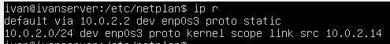
<center>*Новый шлюз совпадает с выставленным ранее*</center></div>

**3.11 Узнаем статический dns-сервер.**
 Для этого посмотрим, какой dns использует сервис systemd-resolve:

```
systemd-resolve --status
```

<div align="center">

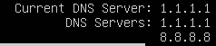
<center>*Текущий статический dns*</center></div>

**3.12 Пингуем удаленный хост ya.ru:**

```
ping ya.ru
```
<div align="center">

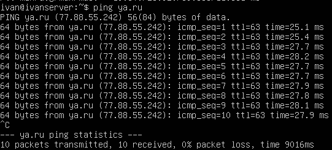
<center>*Проверка соединения с удаленным хостом ya.ru*</center></div>

**3.13 Пробуем пропинговать удаленный хост 1.1.1.1:**

```
ping 1.1.1.1
```
<div align="center">

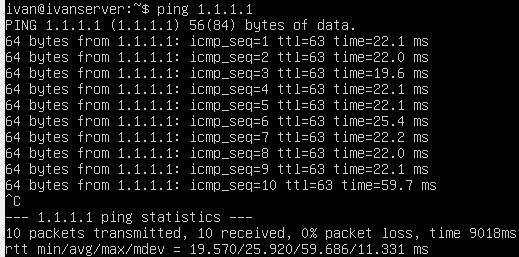
<center>*Проверка соединения с удаленным хостом 1.1.1.1*</center></div>


Удаленные хосты ``1.1.1.1`` и ``ya.ru`` успешно пропингованы. В выводе команд есть фраза «0% packet loss».

## Part 4. Обновление ОС

**4.1 Обновим список пакетов с помощью команды**

```
sudo apt update
```
<div align="center">

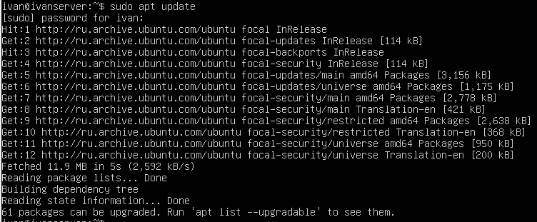
<center>*Обновление пакетов*</center></div>

**4.2 Установим доступные обновления с помощью команды:**

```
sudo apt upgrade
```
<div align="center">

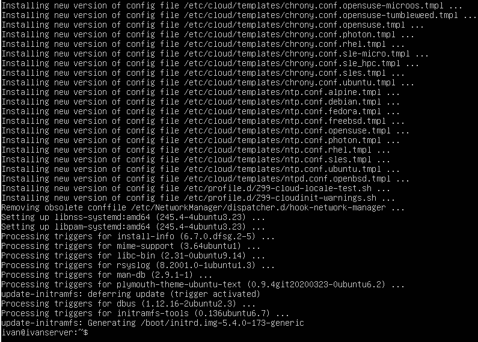
<center>*Установка обновлений*</center></div>

**4.3 Для проверки новой версии Ubuntu пропишем:**

```
sudo do-release-upgrade
```
<div align="center">

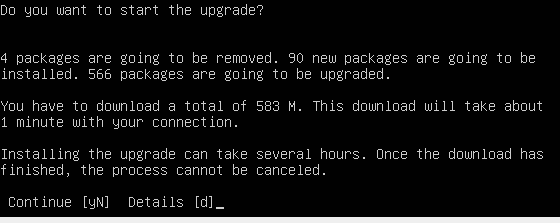
<center>*Проверка на новую версию Ubuntu*</center></div>

Устанавливаем новую версию Ubuntu

**4.4 Прверяем обновления**

<div align="center">

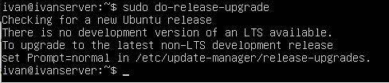
<center>*Проверка на новую версию Ubuntu*</center></div>

Ubuntu обновлен до последней версии и не нуждается в обновлении

## Part 5. Использование команды sudo

* Команда ``sudo`` (сокращение от "superuser do") позволяет пользователю выполнять команды с правами администратора (superuser) в системе Linux. Это необходимо для выполнения операций, требующих повышенных привилегий, таких как установка программного обеспечения, редактирование системных файлов, управление сетью и т.д.

**5.1 Проверим текущие группы пользователя с помощью команды**

```
groups ivan_test
```
<div align="center">

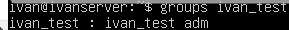
<center>*Проверка групп пользователя*</center></div>

**5.2 Добавим пользователя ivan_test в группу sudo**

```
sudo usermod -aG sudo ivan_test
```

**5.3 Снова проверим группы ivan_test**

<div align="center">
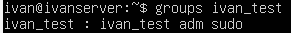
<center>*ivan_test добавлен в группу sudo*</center></div>

**5.4 Заходим за ivan-test**

```
sudo su ivan_test
```
<div align="center">


<center>*Зашли за ivan_test*</center></div>

**5.5 Проверим текущее имя хоста**

```
hostnamectl
```

**5.6 Изменим имя хоста через sudo и учетку, созданую в части 2**

```
sudo hostnamectl set-hostname user
```

**5.7 Снова проверим имя хоста**

<div align="center">

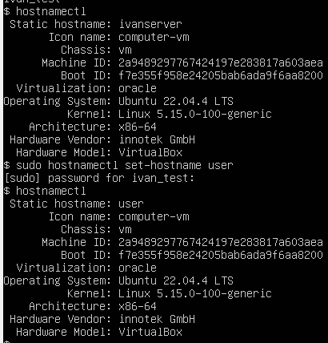
<center>*Измененное имя хоста через учетку ivan_test*</center></div>

## Part 6. Установка и настройка службы времени

**6.1 Выведем время часового пояса**

Прописываем:

```
timedatectl
```
<div align="center">

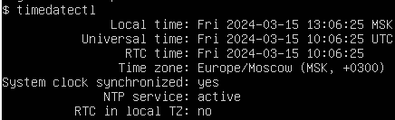
<center>*Информация о времени* </center></div>

Далее прописываем:

```
timedatectl show
```

<div align="center">

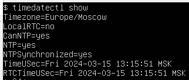
<center>*NTPSynchronized установлен верно* </center></div>

## Part 7. Установка и использование текстовых редакторов

**7.1 Создадим файл test_vim.txt**

```
sudo vim test_vim.txt
```

Откроется режим команд в файле. При нажатии на "i" (insert) можно редактировать файл. Напишем в него никнейм 

<div align="center">

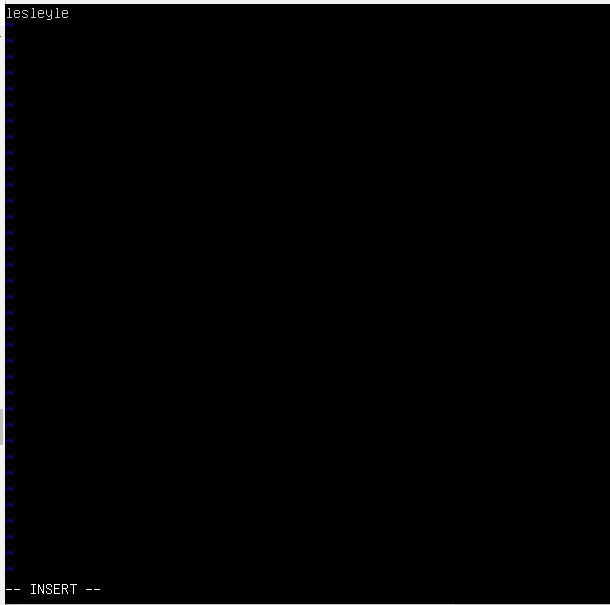
<center>*Ник в файле test_vim.txt* </center></div>

После нажимаем "esc" и вновь выходим в режим команд. Прописываем ``":wq"`` для выхода с сохранением изменений

**7.1 Создадим файл test_nano.txt**

```
sudo nano test_nano.txt
```

Файл сразу откроется в режиме редактирования. Напишем в него никнейм.

<div align="center">

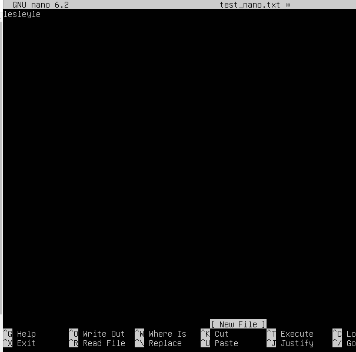
<center>*Ник в файле test_nano.txt* </center></div>

После нажимаем ``"ctrl" + "s"`` для сохранения изменений и ``"ctrl" + "x"``  для выхода из редактора. 

**7.2 Создадим файл test_joe.txt**

```
sudo joe test_joe.txt
```

Файл сразу откроется в режиме редактирования. Напишем в него никнейм.
<div align="center">


<center>*Ник в файле test_joe.txt* </center></div>

После нажимаем ``"ctrl" + "k"`` для выхода в командное меню, после  нажимаем ``"s"``  для сохранения изменений. Будет предложено изменить имя файла - просто жмем ``"enter"`` и сохраняем с тем же именем, что и было при создании. Снова нажимаем ``"ctrl" + "k"`` и ``"x"`` для выхода из редактора. 

**7.3 Отредактируем файл test_vim.txt**

```
sudo vim test_vim.txt
```

Изменяем содержимое файла на ``21 School 21``:

<div align="center">

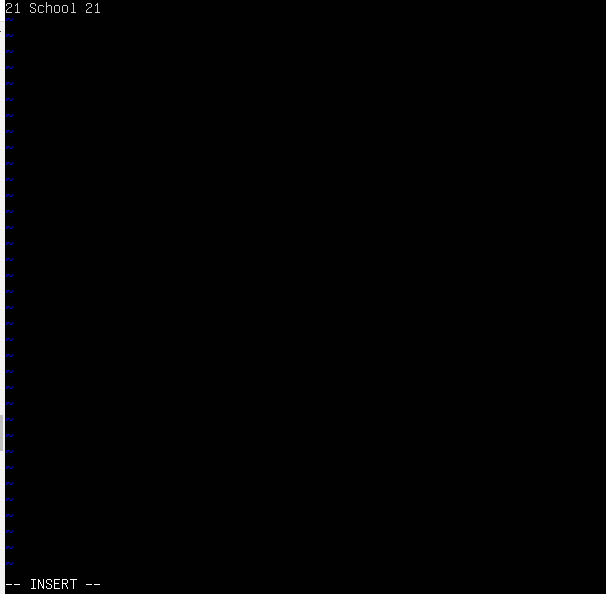
<center>*21 School 21 в файле test_vim.txt* </center></div>

После нажимаем "esc" и вновь выходим в режим команд. Прописываем ``":q!"`` для выхода без сохранения изменений.

**7.4 Отредактируем файл test_nano.txt**

```
sudo nano test_nano.txt
```

Стерем прошлую запись и напишем ``"21 School 21"``

<div align="center">

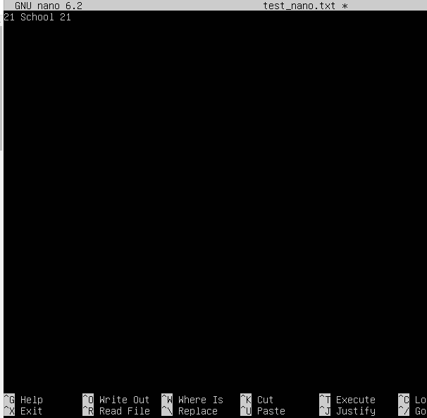
<center>*21 School 21 в файле test_nano.txt* </center></div>

После нажимаем ``"ctrl" + "x"`` для выхода из редактора. Будет предложено сохранить изменения перед выходом. Пишем ``n`` и выходим без сохранения изменений.

**7.5 Отредактируем файл test_joe.txt**

```
sudo joe test_joe.txt
```

Изменим текст на ``"21 School 21"``

<div align="center">

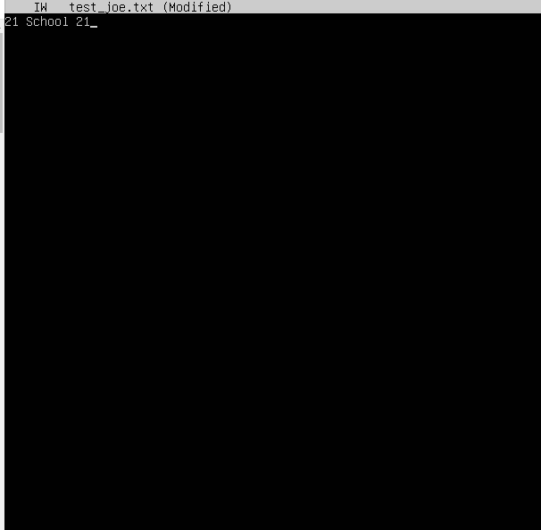
<center>*21 School 21 в файле test_joe.txt* </center></div>

После нажимаем ``"ctrl" + "с"`` для выхода из режима редактирования. Во всплывающем окошке отказываемся от сохранения изменений, прописывая ``"n"`` и нажимая ``"enter"``

**7.6 Поиск вхождения слова в строку. Изменим файл test_vim.txt**

```
sudo vim test_vim.txt
```

Изменяем содержимое файла на ``les ley le``:

<div align="center">

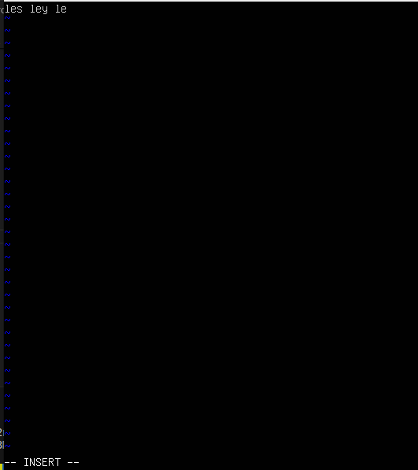
<center>*les ley le в файле test_vim.txt* </center></div>

Для поиска в файле нажимаем ``"esc"`` и прописываем ``"/le"`` для поиска этого слова в документе. Для перехода по найденым словам нажимаем ``"n"``.

<div align="center">

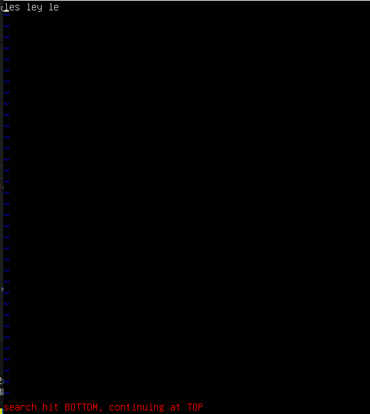
<center>*Результат поика "le" в файле test_vim.txt* </center></div>

После нажимаем ``"esc"`` и прописываем ``":%s/le/xyle/g"`` для замены всех ``"le"`` на ``"xyle"`` в тексте.

<div align="center">

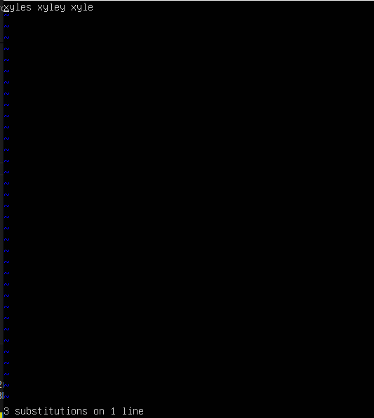
<center>*результат замены в файле test_vim.txt* </center></div>

**7.7 Поиск вхождения слова в строку в nano** 

Изменим файл test_nano.txt:
```
sudo nano test_nano.txt
```

Изменяем содержимое файла на ``les ley le``

Для поиска в файле нажимаем ``"ctrl" + "w"`` и прописываем ``"/le"`` для поиска этого слова в документе. Для перехода по найденым словам нажимаем ``"alt" + "w"``.

<div align="center">

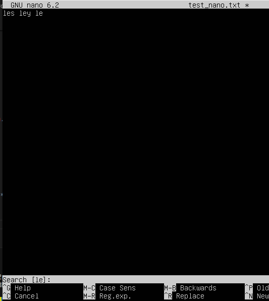
<center>*Результат поика "le" в файле test_nano.txt* </center></div>

После нажимаем ``"ctrl" + "\"`` и прописываем: что надо заменить (``le``), на что (``xyle``). После нужно будет выбрать, заменить все (``"A"``), отдельные слова (``"Y"``) или ничего. Выберем ``"A"``.

<div align="center">

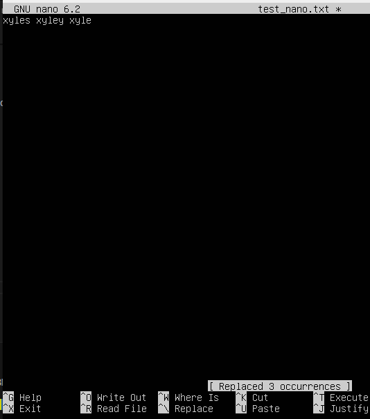
<center>*Результат замены в файле test_nano.txt* </center></div>

**7.8 Поиск вхождения слова в строку в joe**

Изменим файл test_joe.txt:
```
sudo nano test_joe.txt
```
Изменяем содержимое файла на ``les ley le``

Для поиска в файле нажимаем ``"ctrl" + "k"``, потом нажимаем ``"f"``и прописываем ``"le"`` для поиска этого слова в документе. После появится меню с возожными действиями. При нажатии ``w`` найдется прошлое вхождение слова, а при ``"n"``- следующее.

<div align="center">

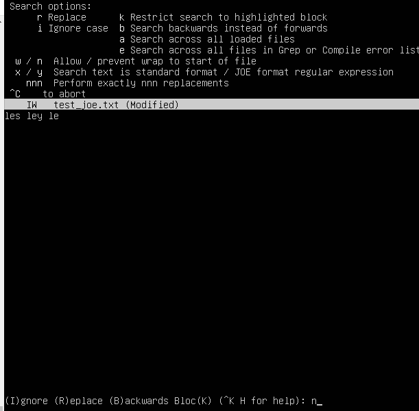
<center>*Результат поика "le" в файле test_joe.txt* </center> </div>

Для замены вхождений нужно нажать``"ctrl" + "k"`` +  ``"f"`` и выбрать заменяемое слово (``le``). После нужно выбрать режим ``R(replace)`` и на что  заменить(``xyle``). Далее можно выбрать ``"R"`` и заменить все вхождения

<div align="center">

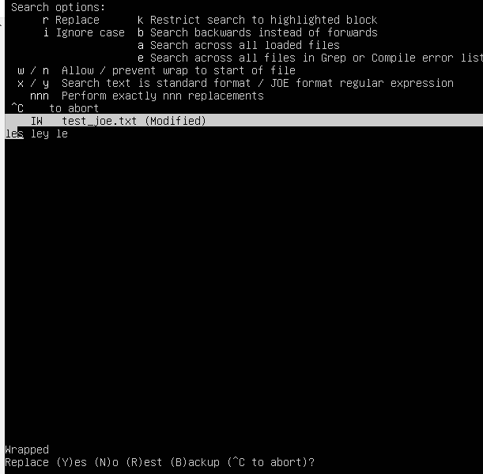
<center>*Перед заменой в файле test_joe.txt* </center> </div>


<div align="center">

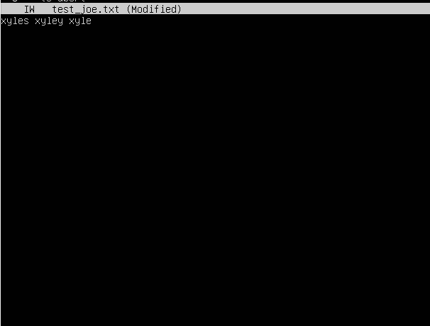
<center>*После замены в файле test_joe.txt* </center></div>

## Part 8. Установка и базовая настройка сервиса SSHD.

**8.1 Установим службу SSHd**

```
sudo apt update && sudo apt install openssh-server -y
```

Данной программой мы обновляем  пакеты  и пытамемся установить ``openssh-server``, но он уже установлен. Опция -y используется для автоматического подтверждения всех запросов на установку пакетов

<div align="center">

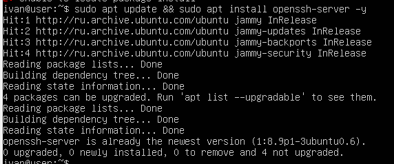
<center>*SSHd уже установлен* </center></div>

**8.2  Добавим службу в автостарт**

Пропишем:
```
sudo systemctl enable ssh
```

<div align="center">

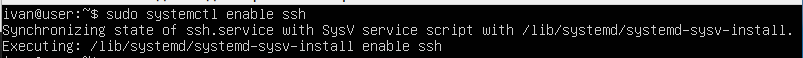
<center>*Добавили SSHd в атозагрузку* </center></div>

**8.3  Перенастроим службу SSHd на порт 2022**

Для этого откроем файл конфигурации SSH с помощью текстового редактора nano

```
sudo nano /etc/ssh/sshd_config
```

Найдем строку ``#Port 22`` и заменим ее на ``Port 2022``

<div align="center">


<center>*Изменили порт* </center></div>

Перезапустим службу SSH, чтобы изменения вступили в силу:

```
sudo systemctl restart ssh
```

**8.4  Используя команду ``ps`` и ключи ``aux`` покажем наличие процесса sshd**

```
ps aux | grep sshd
```

где:
``ps`` — команда, которая показывает список текущих процессов.

``a`` — отображает процессы, выполняемые другими
пользователями.

``u`` — отображает владельца, время запуска и статус.

``x`` — отображает процессы, не имеющие контрольного терминала.

<div align="center">

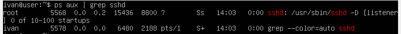
<center>*Процессы SHHd* </center></div>

Мы наблюдаем два процесса: основной и дочерний 

Основной процесс слушает порт, на который клиенты подключаются к серверу SSH. Дочерний процесс отвечает за аутентификацию клиента, шифрование и дешифрование трафика, а также выполнение команд, отправленные клиентом.

**8.5 Перезагрузим систему**

```
sudo reboot
```

**8.6 Установим netstat**

```
sudo apt install net-tools -y
```

Выполним:

```
sudo netstat -tan
```
<div align="center">

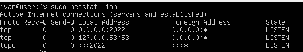
<center>*Процессы SHHd* </center></div>

``netstat`` - это утилита командной строки, которая используется для отображения информации о сетевых соединениях, маршрутах и протоколах

Значение ключей:
``-t``— отображает только TCP-соединения.
``-a`` — отображает все соединения.
``-n`` — отображает IP-адреса и порты в числовом формате, а не в символьном.

Значение столбцов вывода:

``Proto`` — протокол, используемый соединением (TCP или UDP).
``Recv-Q`` — количество байтов, ожидающих чтения в буфере приемника.

``Send-Q`` — количество байтов, ожидающих отправки в буфере передатчика.

``Local Address`` — IP-адрес и номер порта локального сокета.

``Foreign Address`` — IP-адрес и номер порта удаленного сокета.

``State`` — текущее состояние соединения.

Значение ``0.0.0.0`` в столбце Local Address означает, что сервер слушает все доступные сетевые интерфейсы. Это означает, что клиенты могут подключаться к серверу с любого сетевого интерфейса, доступного на сервере.

## Part 9. Установка и использование утилит top, htop

**9.1 Запустим top**

<div align="center">

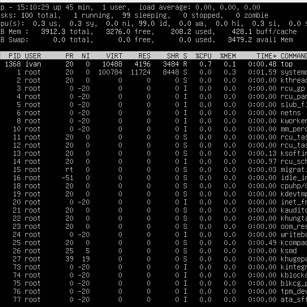
<center>*Вывод команды top* </center></div>

``uptime:`` 45 min

``Количество авторизованных пользователей:`` 1 user

``Общая загрузка системы:`` 0.00, 0.00, 0.00

``Общее количество процессов:`` 100

``Загрузка cpu:`` 

    us: 0.3%(процент времени, затраченного на выполнение пользовательских процессов).

    sy: 0.3% 
    (процент времени, затраченного на выполнение системных процессов).

    ni: 0.0% (процент времени, затраченного на выполнение процессов с низким приоритетом).

    id: 99% (процент времени, в течение которого процессор был в простое).

    wa: 0.0% (процент времени, затраченного на ожидание ввода-вывода).

    hi: 0.0% процент времени, затраченного на обработку аппаратных прерываний.

    si: 0.3% процент времени, затраченного на обработку программных прерываний.

    st: процент времени, затраченного на выполнение гостевых систем в виртуальной среде.

``Загрузка памяти:`` 

    Всего памяти: 3912.3

    Свободно памяти: 3276.0

    Использовано:208.2

    Кэш: 428.1

``Файл подкачки:`` не используется, но доступно 3479.2

Отсортируем процессы по памяти нажав в top 
``Shift`` + ``M``

<div align="center">

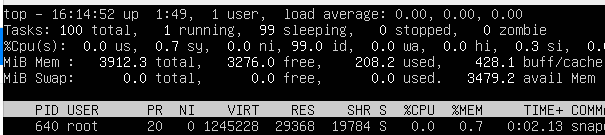
<center>*Отсортированный по занимаемой памяти список* </center></div>

``pid процесса занимающего больше всего памяти:`` 640

Отсортируем процессы по процессорному времени, нажав в top 
``Shift`` + ``P``

<div align="center">

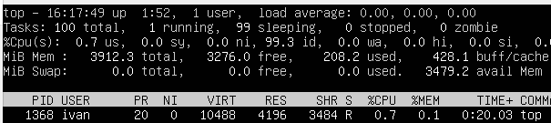
<center>*Отсортированный по процессорному времени список* </center></div>

``pid процесса занимающего больше всего процессорного времени:`` 1368

**9.2 Запустим htop**

<div align="center">

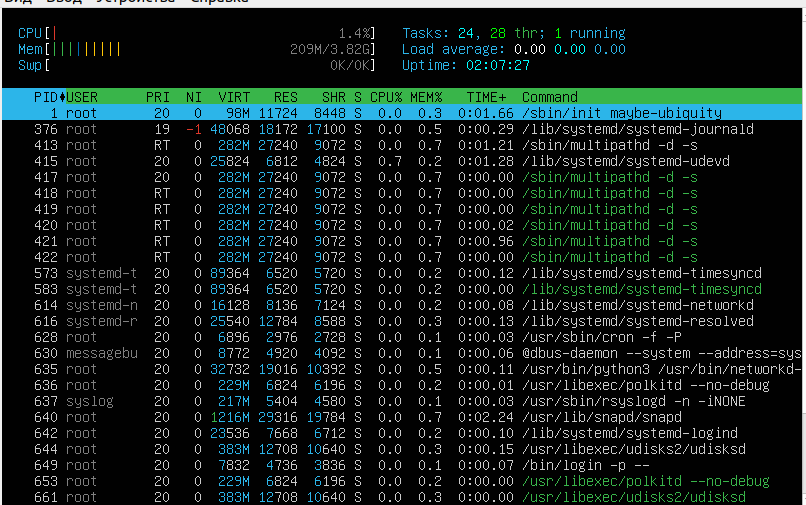
<center>*Отсортированный по PID список* </center></div>

<div align="center">

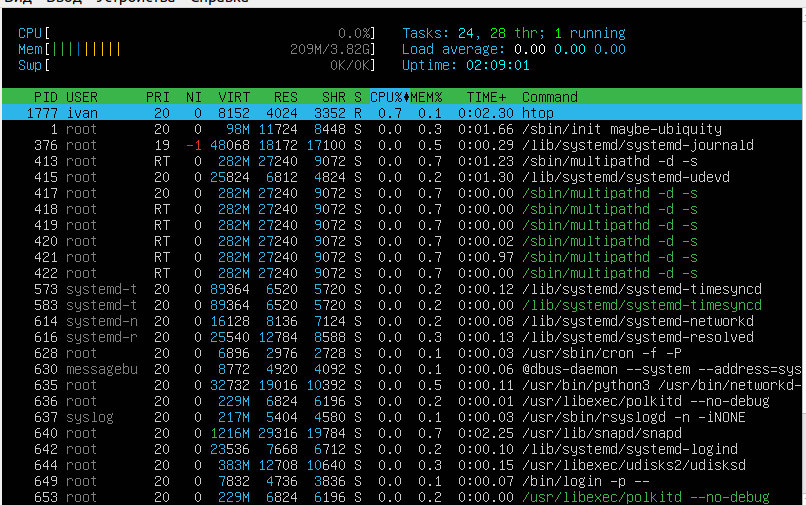
<center>*Отсортированный по CPU список* </center></div>

<div align="center">

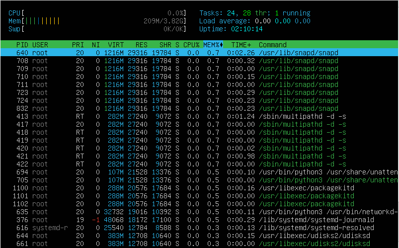
<center>*Отсортированный по MEM список* </center></div>

<div align="center">

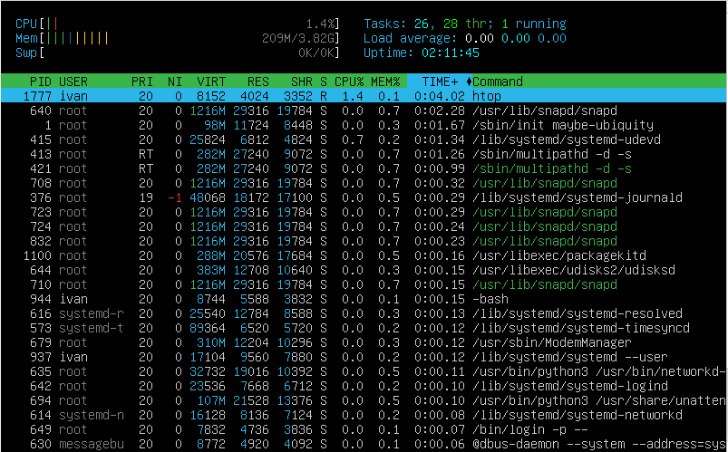
<center>*Отсортированный по TIME список* </center></div>

<div align="center">


<center>*Отсортированный по TIME список* </center></div>

<div align="center">

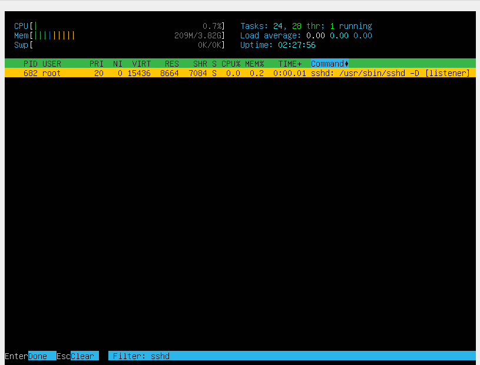
<center>*Отфильтрованный по процессу sshd список* </center></div>

<div align="center">

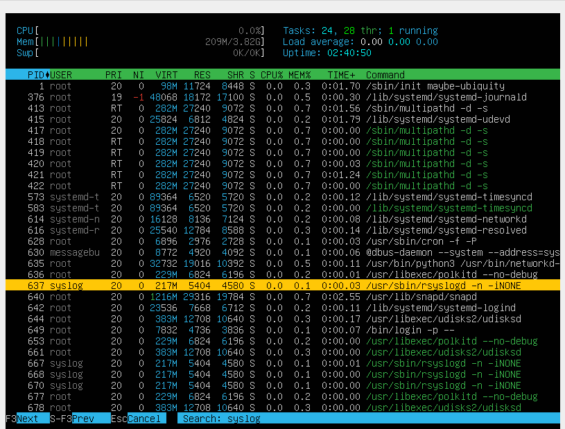
<center>*Поиск по процессу syslog* </center></div>

<div align="center">

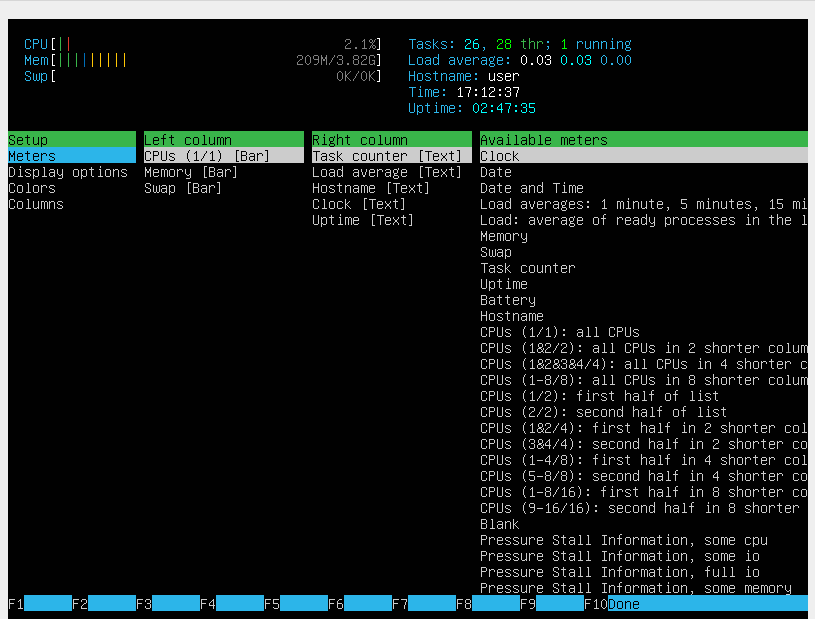
<center>*С добавленным выводом hostname, clock и uptime* </center></div>

## Part 10. Использование утилиты fdisk

**10.1  Запустим fdisk**

```
sudo fdisk -l
```

<div align="center">

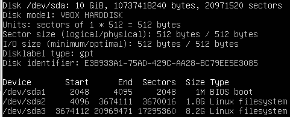
<center>*Вывод fdisk с флагом l (list)* </center> </div>

Здесь: 

Название жесткого диска: /dev/sda

Размер диска: 10 GiB

Количество секторов: 10736418249

Чтобы выяснить размер файла покачки, пропишем:

```
free -h
```

Флаг h  показывает информацию в удобночитаемом виде

<div align="center">

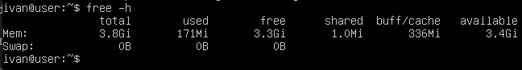
<center>*Информация о памяти* </center></div>

Размер swap: 0 B

# Part 11. Использование утилиты df

**11.1 Пропишем команду ``fd``**

<div align="center">

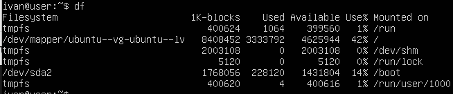
<center>*Информация о дисковом пространстве* </center></div>

Описание корневого раздела:

Размер раздела: 8408452 блока

Размер занятого пространства: 3333792 блока

Размер свободного пространства: 4625944 блока

Процент использования: 42%

Единица измерения в выводе: килобайт

**11.2 Запустим команду ``df -Th``**
 
 <div align="center">

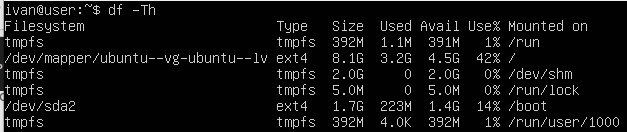
<center>*Информация о дисковом пространстве c флагами Th* </center></div>

Флаг T позволяет узнать тип файловой системы.

Информация о корневом разделе:

Размер раздела: 8.1G

Размер занятого пространства: 3.1G

Размер свободного пространства: 4.5G

Процент использования: 42%

Тип файловой системы: ext4

# Part 12. Использование утилиты du

**12.1 Выведем размер папок ``/home``, ``/var``, ``/var/log`` (в байтах, в человекочитаемом виде)**

<div align="center">

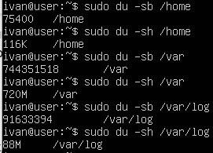
<center>*Размеры заданных папок* </center></div>

**12.2 Выведем размер каждого вложенного элемента в ``/var/log``**

<div align="center">

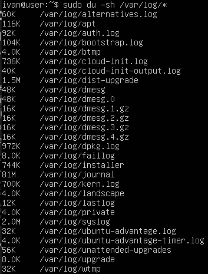
<center>*Размеры вложенных элементов в /var/log* </center></div>

# Part 13. Установка и использование утилиты ncdu

Пропишем в терминале

```
sudo ncdu /
```

**13.1 Выведем размер папок ``/home`` и  ``/var``**

<div align="center">

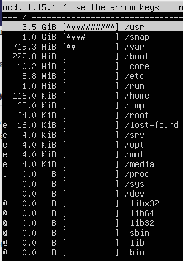
<center>*Размеры home и var видны в общем списке*</center></div>

**13.2 Отобразим размеры папок и файлов в /var/log** 

Пропишем:

```
sudo ncdu /var/log
```

<div align="center">

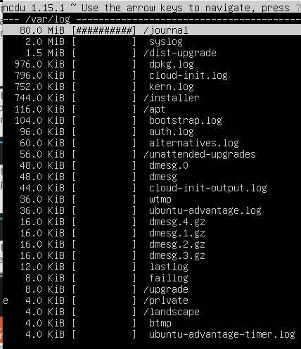
<center>*Размеры папок и файлов в /var/log*</center></div>

# Part 14. Работа с системными журналами

`/var/log/dmesg` - файл журнала системных сообщений в Linux. В этом файле содержатся сообщения ядра и драйверов, которые генерируются при загрузке системы и во время ее работы.

`/var/log/syslog` - это файл журнала системных сообщений в Linux. В этом файле содержатся сообщения от различных системных процессов и приложений, которые генерируются во время работы системы.

`/var/log/auth.log` - это файл журнала аутентификации в Linux. В этом файле содержатся сообщения об аутентификации пользователей, включая успешные и неуспешные попытки входа в систему, смену паролей и другие события, связанные с аутентификацией.

**14.1 Просмотрим время последней успешной авторизации, имя пользователя и метод входа в систему**

Пропишем:

```
sudo less /var/log/auth.log
```
<div align="center">


<center>*Последняя успешная авторизация*</center></div>

Время авторизации: 23:01:51

Имя пользователя: ivan

Метод входа в систему: by LOGIN

Перезапустим службу SSHd:
```
sudo systemctl restart sshd
```
<div align="center">

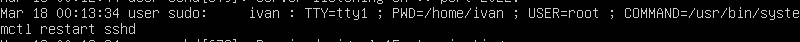
<center>*Запись в логах о перезапуске службы shh*</center></div>

# Part 15. Использование планировщика заданий CRON

**15.1 Используя планировщик заданий, запустим команду uptime через каждые 2 минуты**

Пропишем:
```
sudo crontab -e
```
В открывшемся окне добавим в конец ``*/2 * * * * uptime ``

``*/2`` Означает, что команда должна выполняться каждые две минуты. Остальные символы * означают, что задание должно выполняться каждый час, каждый день месяца, каждый месяц и каждый день недели.

<div align="center">

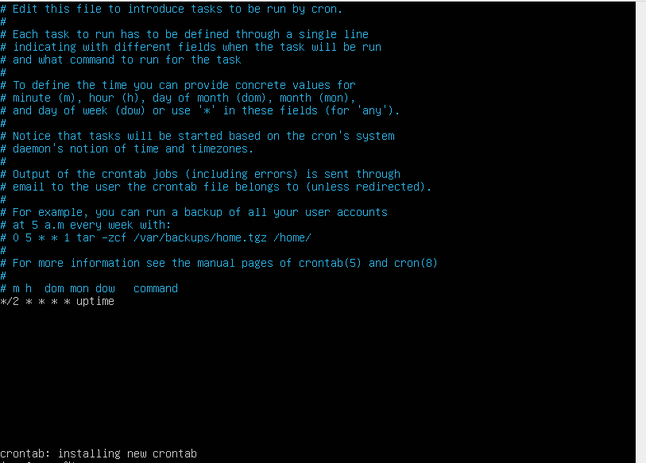
<center>*Запуск uptime через каждые 2 минуты*</center></div>

**15.2 Запустим логи и убедимся, что задание отрабатывает через каждые 2 минуты**

Пишем:

```
sudo less /var/log/syslog
```
<div align="center">

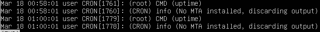
<center>*Результат работы CRON в логах*</center></div>

**15.3 Выведем список текущих заданий для CRON**

```
sudo crontab -l
```
<div align="center">

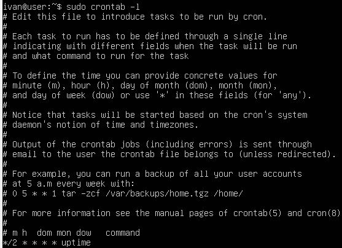
<center>*Задачи в CRON*</center></div>

**15.4 Удалим текущие задачи для CRON** 

Пропишем:

```
sudo crontab -r
```
<div align="center">

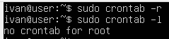
<center>*Проверка отсутствия задач*</center></div>