# DO5_SimpleDocker-1 lesleyle

## Part 1. Готовый докер

Возьмем официальный докер-образ с nginx и выкачаем его при помощи ``docker pull nginx``

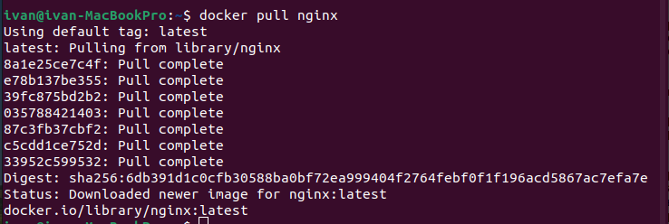

*Выкаченный докер-образ с nginx*

Проверим наличие докер-образа через ``docker images``.

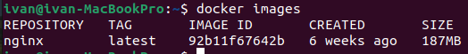

*Список доступных докер-образов*

Запустим докер-образ через docker ``run -d [image_id|repository]``

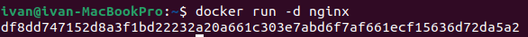

*Запуск докер-образа*

Проверим, что образ запустился через ``docker ps``

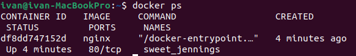

*Вывод docker ps*

Посмотрим информацию о контейнере через `docker inspect [container_id]`

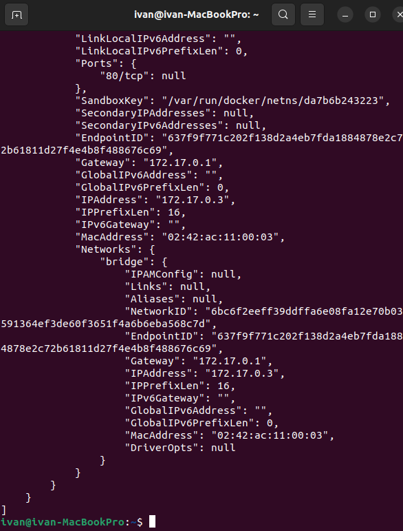

*Информация о контейнере*

По выводу команды определим и поместим в отчёт список замапленных портов и ip контейнера.

Замапленные порты (mapped ports) в Docker - это порты, которые были связаны между хостом и контейнером. Это позволяет контейнеру обмениваться данными с внешним миром через сеть.

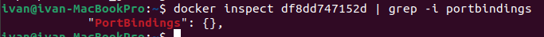

*Замапленные порты*

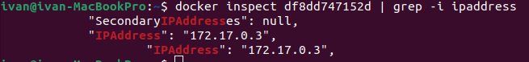

*ip контейнера*

Размер контейнера мы найдем через `docker ps -s`

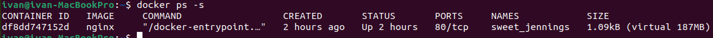

*Информация о размере контейнера*

Здесь 1.09 кб это размер контейнера, а 187 мб - общий размер всех ресурсов, используемых контейнером

Остановим докер образ через `docker stop [container_id|container_name]` и проверим, что образ остановился через `docker ps`.

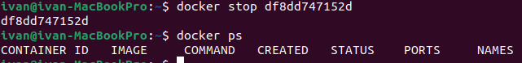

*Остановка образа и проверка*

Запустим докер с портами 80 и 443 в контейнере, замапленными на такие же порты на локальной машине, через команду `run`.

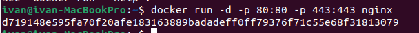

*Запуск докера с портами 80 и 443*

Проверим, что в браузере по адресу `localhost:80` доступна стартовая страница nginx

*Стартовая страница nginx*

Перезапустим докер контейнер через `docker restart [container_id]` и проверим, что контейнер запустился.

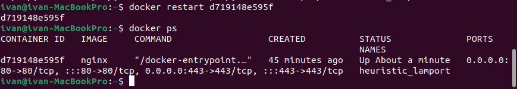

*Презапуск и проверка контейнера*

## Part 2. Операции с контейнером

Прочитаем конфигурационный файл `nginx.conf` внутри докер контейнера через команду `exec`

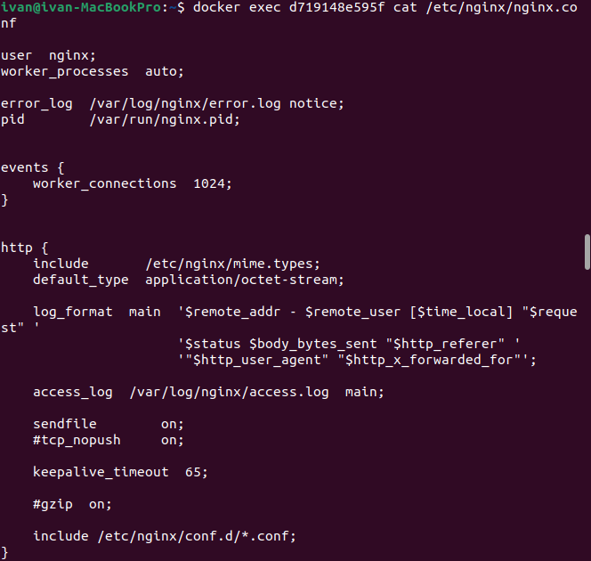

*Содержимое nginx.conf*

Создадим на локальной машине файл `nginx.conf` и настрой в нем по пути `/status` отдачу страницы статуса сервера nginx.

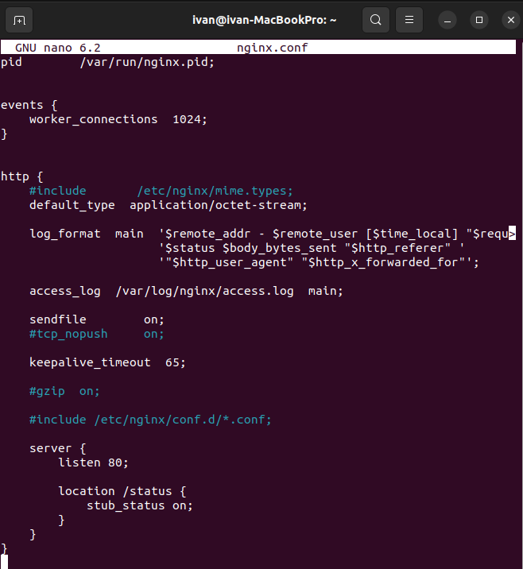

*Содержимое nginx.conf на локальной машине*

Скопируем созданный файл `nginx.conf` внутрь докер-образа через команду `docker cp` и перезапустим `nginx` внутри докер-образа через команду `exec`.

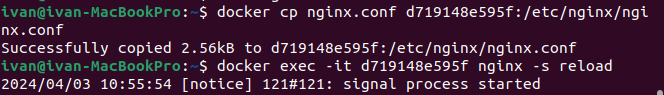

*Копируем nginx.conf и перезапускаем nginx*

Проверим, что по адресу `localhost:80/status` отдается страничка со статусом сервера `nginx`.

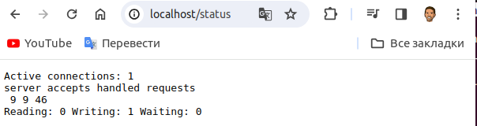

*Содержимое localhost:80/status*

Экспортируем контейнер в файл `container.tar `через команду `export` и остановим контейнер

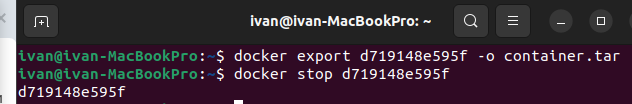

*Экспорт и остановка контейнера*

Удалим образ через ``docker rmi [repository]``, не удаляя перед этим контейнер, а потом удалим остановленный контейнер.

*Удаление докер образа и контейнера*

Импортируем контейнер обратно через команду `import` и запустим импортированный контейнер.

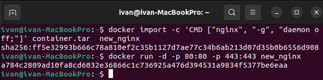

*Импорт и запуск контейнера*

Здесь:

Опция `-c` позволяет указать команду, которая будет выполнена при запуске контейнера на основе образа. 
 
В данном случае опция `-c 'CMD ["nginx", "-g", "daemon off;"]`' указывает, что при запуске контейнера на основе импортированного образа должна быть выполнена команда `nginx -g "daemon off;"`. Эта команда запускает веб-сервер nginx в переднем плане, без демонизации. 
 
Опция `CMD` используется для установки команды по умолчанию, которая будет выполнена при запуске контейнера. В данном случае опция `-c` используется для переопределения команды по умолчанию, указанной в Dockerfile, при импорте образа.  
 
Опция `-g` используется для установки глобальных директив конфигурации `nginx`.

Проверим, что по адресу `localhost:80/status` отдается страничка со статусом сервера `nginx`.

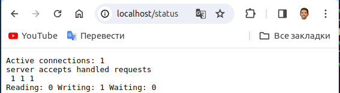

*Проверка странички `localhost:80/status`*

## Part 3. Мини веб-сервер

Напишем мини-сервер на C и FastCgi, который будет возвращать простейшую страничку с надписью Hello World!

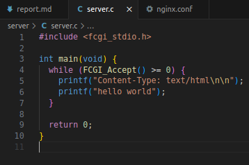

*Мини-сервер на С*

Здесь:

`fcgi_stdio.h` cодержит определения функций и констант для работы с FastCGI.

Функция `FCGI_Accept`, которая ожидает входящий FastCGI-запрос от веб-сервера. Если функция FCGI_Accept возвращает значение больше или равное нулю, это означает, что запрос успешно принят и может быть обработан.

Функция `printf` служит для отправки HTTP-заголовка `Content-Type: text/html` и тела ответа `hello world` в стандартный вывод. Этот вывод будет перенаправлен в `FastCGI-сокет` и отправлен клиенту в качестве ответа на входящий запрос.

Запустим написанный мини-сервер через `spawn-fcgi` на порту `8080`.

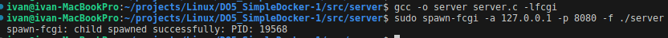

*Запуск мини-сервера*

`Spawn-fcgi` — это утилита, которая запускает приложение FastCGI и управляет его жизненным циклом. Она может запускать приложение в фоновом режиме, перенаправлять ввод/вывод в файлы или сокеты, и мониторить работу приложения, перезапуская его в случае необходимости

Напишем свой `nginx.conf`, который будет проксировать все запросы с `81` порта на `127.0.0.1:8080`.Для этого перейдем в `/etc/nginx` и исправим `nginx.conf`

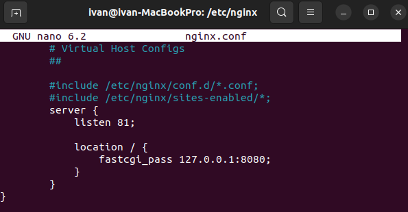

*Файл nginx.conf*

Скопируем файл конфигурации в папку `server/nginx` проекта.

Проверим, что в браузере по `localhost:81` отдается написанная страничка.

*Страничка по адресу localhost:81*

## Part 4. Свой докер

Напишем свой докер-образ, который:

1) собирает исходники мини сервера на FastCgi из Части 3;

2) запускает его на 8080 порту;

3) копирует внутрь образа написанный nginx.conf;

4) запускает nginx.

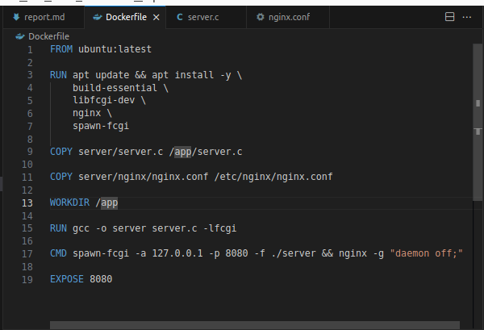

*Свой докер-образ*

Соберем написанный докер-образ через `docker build` при этом указав имя и тег.

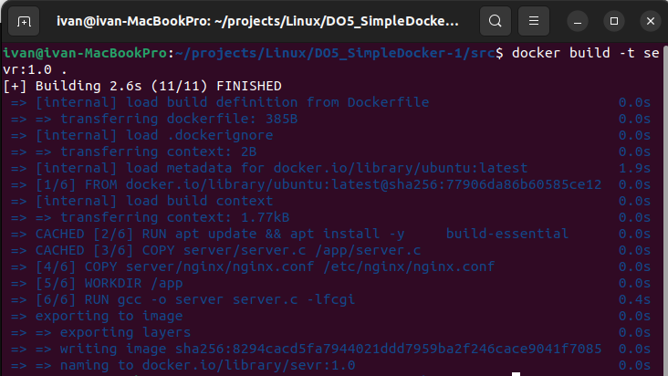

*Сборка контейнера*

Проверим через `docker images`, что все собралось корректно.

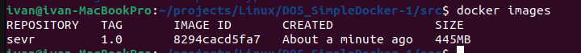

*Докер образ*

Запустим собранный докер-образ с маппингом `80` порта локальной машины на `81` порт контейнера и маппингом папки `./nginx` внутрь контейнера по адресу, где лежат конфигурационные файлы nginx'а

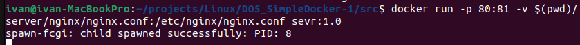

*Запущенный докер-образ*

Проверим, что по `localhost:80` доступна страничка написанного мини сервера.

*Страничка на localhost:80*

Допишем в `./nginx/nginx.conf` проксирование странички `/status`, по которой надо отдавать статус сервера nginx.

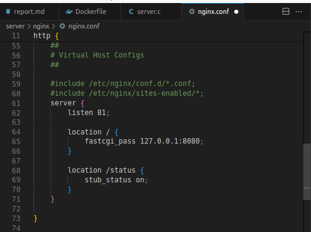

*Содержимое ./nginx/nginx.conf*

Перезапустим докер-образ 

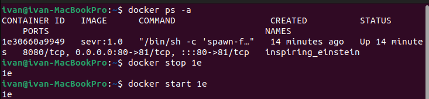

*Перезапуск контейнера*

Проверим, что теперь по `localhost:80/status` отдается страничка со статусом nginx

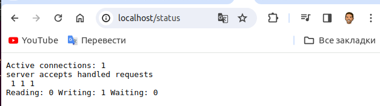

*Содержимое localhost:80/status*

## Part 5. Dockle

Просканируем образ из предыдущего задания через `dockle repository`.

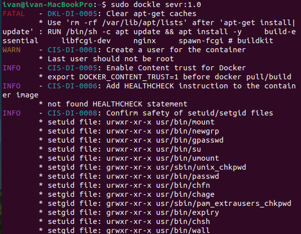

*Ошибки и педупреждения докер-образа*

Исправим образ так, чтобы при проверке через dockle не было ошибок и предупреждений.

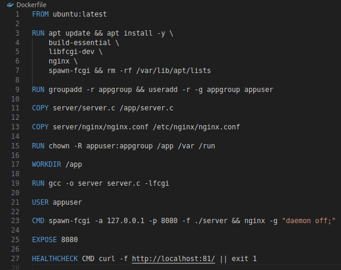

*Исправленнй докер-образ*

Здесь:

`rm -rf /var/lib/apt/lists` - очистка кэша apt-get.

`RUN groupadd -r appgroup && useradd -r -g appgroup appuser` :

1) `groupadd -r appgroup`- Создает системную группу appgroup.

2) `useradd -r -g appgroup appuser` - Создает системного пользователя `appuser` и добавляет его в группу `appgroup`. Флаги `-r` создают системного пользователя, а опция `-g` назначает пользователю его основную группу.

`chown -R appuser:appgroup /app /var /run` - Изменяет владельца и группу для указанной директории /app и всех ее содержимых файлов и поддиректорий рекурсивно.

`USER appuser` - Эта инструкция переключает исполнение последующих команд в Dockerfile на пользователя `appuser`. Это помогает улучшить безопасность контейнера, поскольку процессы будут запущены с меньшими привилегиями.

`HEALTHCHECK CMD curl -f http://localhost:81/ || exit 1` - устанавливает curl-запрос к `http://localhost:81/` в качестве способа проверки работоспособности контейнера. Если контейнер не может успешно выполнить этот запрос, он будет считаться нерабочим. 

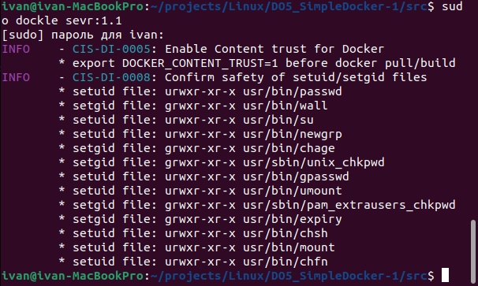

*Проверка исправленного образа*

## Part 6. Базовый Docker Compose

Напишем файл `docker-compose.yml`, с помощью которого:

1) Поднимем докер-контейнер из Части `5` (он должен работать в локальной сети, т.е. не будем использовать инструкцию `EXPOSE` и мапить порты на локальную машину).

2) Подними докер-контейнер с `nginx`, который будет проксировать все запросы с `8080` порта на `81` порт первого контейнера.

3) Замапим `8080` порт второго контейнера на `80` порт локальной машины.

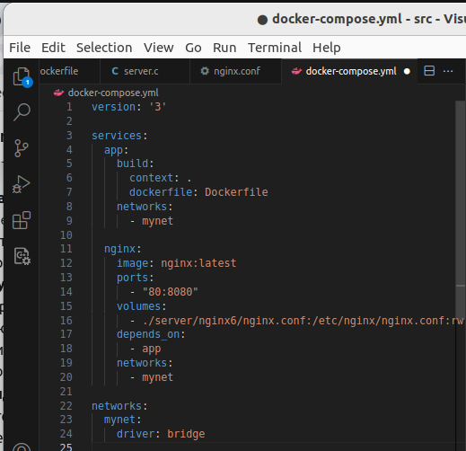

*docker-compose.yml файл*

*Файл nginx.conf контейнера nginx*

Остановим все запущенные контейнеры, соберем и запустим проект с помощью команд `docker-compose build` и `docker-compose up`.

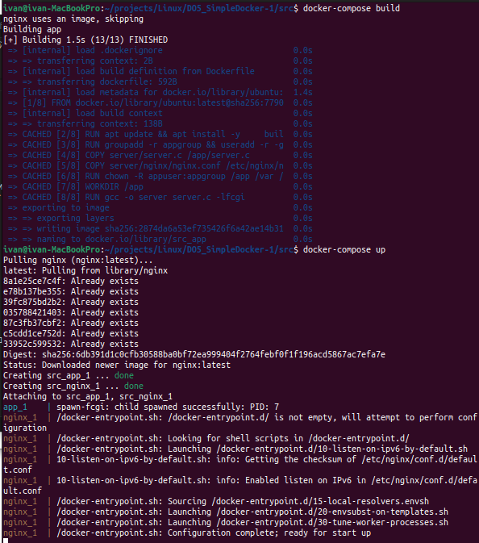

*Сборка проекта*

Проверим, что в браузере по `localhost:80` отдается написанная нами ранее страничка

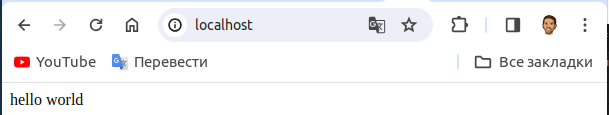

*Содержимое по адресу localhost:80*

