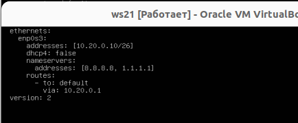
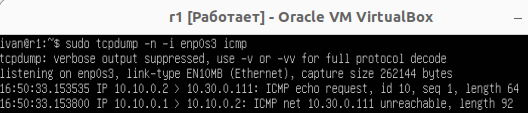

# DO2_LinuxNetwork-1 lesleyle

## Part 1. Инструмент ipcalc

Установим ipcalc
```
sudo apt update && sudo apt upgrade && sudo apt intall ipcalc
```

ipcalc - инструмента, который выполняет расчеты IP-адресов и перевод сетевых адресов. Он может быть использован для определения информации, такой как сетевой адрес, адрес вещательной рассылки и диапазон хостов для заданного IP-адреса и маски подсети.

**1.1 Сети и маски**

Определим и запишим в отчёт:

1) Адрес сети ``192.167.38.54/13``

<div align="center">


*Узнаем адрес сети*
</div>

Адрес сети прописа в строке ``Network`` и равен:
``192.160.0.0./13``

2) Перевод маски ``255.255.255.0`` в префиксную и двоичную запись, ``/15`` в обычную и двоичную, ``11111111.11111111.11111111.11110000`` в обычную и префиксную

Переведём маску ``255.255.255.0`` в префиксную и двоичную запись

<div align="center">


*Переводим маску ``255.255.255.0`` в префиксную и двоичную запись*
</div>

Из скриншота следует, что:

Префиксный вид маски: ``/24``
Двоичная запись маски:
``11111111 11111111 11111111 00000000``

Переведём маску ``/15`` в обычную и двоичную запись

<div align="center">


*Переводим маску ``/15`` в обычный и двоичный вид*
</div>

Из скриншота следует, что:
Обычный вид: ``255.254.0.0``
Двоичный вид: ``11111111 11111110 00000000 00000000``

Переведём маску ``11111111.11111111.11111111.11110000`` в префиксную и обычную запись

К сожалению, мы не можем ввести маску в двоичной форме в качестве входных данных ipcalc :(

Поэтому сначала переведем ее в десятичный вид:
``255.255.255.240`` - маска в обычном виде

В префиксном виде получится ``/28``

3) Минимальный и максимальный хост в сети ``12.167.38.4`` при масках: ``/8``, 11111111.11111111.00000000.00000000, ``255.255.254.0`` и ``/4``

При маске ``/8``:

<div align="center">


*Поиск минимального и максимального хоста с маской ``/8``*
</div>

HostMin: ``12.0.0.1``
HostMax: ``12.255.255.254``

При маске ``11111111.11111111.00000000.00000000``:

Переведем в префиксную запись: ``/16``

<div align="center">


*Поиск минимального и максимального хоста с маской ``/16``*
</div>

HostMin: ``12.167.0.1``
HostMax: ``12.167.255.254``

При маске ``255.255.254.0``:

<div align="center">


*Поиск минимального и максимального хоста с маской ``255.255.254.0``*
</div>

HostMin: ``12.167.38.1``
HostMax: ``12.167.39.254``

При маске ``/4``:

<div align="center">


*Поиск минимального и максимального хоста с маской ``/4``*
</div>

HostMin: ``0.0.0.1``
HostMax: ``15.255.255.254``

**1.2. localhost**

``Localhost`` - это специальное имя хоста, которое используется для обозначения локального компьютера

Диапазон  Localhost: ``127.0.0.0`` — ``127.255.255.255``

Следовательно, можно подключиться к:
``127.0.0.2``, ``127.1.0.1``, 

Нельзя к:
``194.34.23.100``, ``128.0.0.1``.

**1.3. Диапазоны и сегменты сетей**

Существует классификация IP-адресов на «частные» и «публичные». Следующие диапазоны адресов зарезервированы для частных (локальных) сетей:

``10.0.0.0`` — ``10.255.255.255`` ( 10.0.0.0/8 ),

``172.16.0.0`` — ``172.31.255.255`` ( 172.16.0.0/12 ),

``192.168.0.0`` — ``192.168.255.255`` (192.168.0.0/16 ).

Из этого следует:

Публичные IP-адреса: ``134.43.0.2``, ``172.0.2.1``, ``192.172.0.1``, ``172.68.0.2``, ``192.169.168.1``.

Частные IP-адреса: ``10.0.0.45``, ``192.168.4.2``, ``172.20.250.4``, ``172.16.255.255``, ``10.10.10.10``. 

Найдем возможные адреса шлюза у сети ``10.10.0.0/18`` 

<div align="center">


*HostMin и HostMax отвечают за возможные адреса*
</div>

У сети ``10.10.0.0/18`` возможны ip-адреса шлюза: 

``10.10.0.2``, ``10.10.10.10``, ``10.10.1.255``

## Part 2. Статическая маршрутизация между двумя машинами

Поднимим две виртуальные машины ws1 и ws2.

Склонируем машину ws1 сгенерировав новый MAC-адреса и выбрав ``Cвязное клонирование``

<div align="center">


*Клонирование  ws1*
</div>

Далее настроим сеть на виртуальных машинах

<div align="center">


*Настройки сети*
</div>

С помощью команды ``ip a`` посмотрим существующие сетевые интерфейсы на ``ws1`` и ``ws2``

<div align="center">


*Существующие сетевые интерфейсы с разными Mac-адресами*
</div>

Опишим сетевой интерфейс, соответствующий внутренней сети. Зададим следующие адреса и маски: ws1 - ``192.168.100.10``, маска ``/16``, ws2 - ``172.24.116.8``, маска ``/12``.

<div align="center">


*Настраиваем yaml файлы в ws1 и ws2*
</div>

 ``enp0s3`` - имя сетевого интерфейса, соответствующего внутренней сети

 ``DHCP4`` - это четвертая версия протокола Dynamic Host Configuration Protocol (DHCP), который используется для динамического назначения IP-адресов и других параметров сетевой конфигурации устройствам в сети

 ``addresses`` - назначаемый IP-адрес и маска подсети в формате CIDR.

 ``gateway4`` - IP-адрес шлюза по умолчанию.

``nameservers`` - IP-адреса DNS-серверов.

Перезапусти сервис сети и проверим выставленные адреса

<div align="center">


*Правильно выставленный адрес на на ws1*
</div>

<div align="center">


*Правильно выставленный адрес на на ws2*
</div>

**2.1. Добавление статического маршрута вручную**

Добавим статический маршрут от одной машины до другой и обратно при помощи команды вида ``ip r add``. Взаимно пропингуем машины.

<div align="center">


*Добавление статического маршрута и пинг обоих машин*
</div>

**2.2. Добавление статического маршрута с сохранением**

Добавим статический маршрут от одной машины до другой с помощью файла etc/netplan/00-installer-config.yaml

<div align="center">


*Добавление статического маршрутав в файлах yaml*
</div>

Взаимно пропингуем машины:

<div align="center">


*Машины пингую друг друга*
</div>

## Part 3. Утилита iperf3

**3.1 Скорость соединения**

Переведем скорости соединения: 

``8`` Mbps =  ``1`` MB/s; 

``100`` MB/s в ``800 000`` Kbps;

``1`` Gbps в ``1 000`` Mbps.

**3.2 Утилита iperf3**

iperf3 — это программа для измерения пропускной способности сети в реальном времени. Это один из мощных инструментов для тестирования максимально достижимой пропускной способности в IP-сетях (поддерживает IPv4 и IPv6).

Измерим скорость соединения между ws1 и ws2.

Для этого изменим сеть в машинах в virtual box с "Внутренняя сеть" на "NAT" 

<div align="center">


*Смена сети*
</div>

Изменим файл ``yaml`` на обоих машинах подобным образом: 

<div align="center">


*Изменение yaml файла*
</div>

После чего прописываем ``sudo netplan apply`` и скачиваем на обе машины ``iperf3``

После чего возваращаем машины в исходные состояния.

Первую машину поставим в режим сервер 

<div align="center">


*Машина в режиме сервера*
</div>

Вторую машину поставим в режиме клиент

<div align="center">


*Машина в режиме клиента*
</div>

Из отчета iperf3 следует, что скорость соединения клиента 1.93 Гбит/с, а скорость сервера 1.93 Гбит/с.

## Part 4. Сетевой экран

**4.1. Утилита iptables**

``iptables`` — это утилита брандмауэра командной строки, которая использует цепочки политик для разрешения или блокировки трафика. Когда соединение пытается установиться в вашей системе, iptables ищет в своем списке правило, которому оно соответствует. Если он его не находит, он прибегает к действию по умолчанию.

Создадим файл ``/etc/firewall.sh``, имитирующий фаерволл, на ws1 и ws2

<div align="center">


*Создание sh файла на ws 1*
</div>

Добавим следующие правила на машины ws1 и ws2:

1) На ws1 в начале пишем запрещающее правило, а в конце пишем разрешающее правило (это касается пунктов 4 и 5).

2) На ws2 в начале пишем разрешающее правило, а в конце пишем запрещающее правило (это касается пунктов 4 и 5).

3) Откроем на машинах доступ для порта 22 (ssh) и порта 80 (http).

4) Запретим echo reply (машина не должна «пинговаться», т.е. должна быть блокировка на OUTPUT).

5) Разрешим echo reply (машина должна «пинговаться»).

<div align="center">


*Cодержание файла /etc/firewall машины ws1*
</div>

<div align="center">


*Cодержание файла /etc/firewall машины ws2*
</div>

Поясним используемые флаги и аргументы:

``iptables`` - запускает утилиту iptables для управления правилами файрвола.

``-A INPUT`` - добавляет новое правило в цепочку INPUT. Цепочка INPUT обрабатывает входящий сетевой трафик, направленный на локальный хост.

``-p tcp`` - указывает протокол TCP для данного правила.

``--dport 22`` - указывает порт назначения 22 для данного правила. Это означает, что правило будет применяться только к пакетам, направленным на порт 22.

``-j ACCEPT`` - указывает действие, которое будет выполнено для пакетов, соответствующих данному правилу. В этом случае действием будет разрешение (ACCEPT) пакетов, направленных на порт 22.

``-A OUTPUT`` - добавляет новое правило в цепочку OUTPUT. Цепочка OUTPUT обрабатывает исходящий сетевой трафик, генерируемый локальным хостом.

``-p icmp`` - указывает протокол ICMP для данного правила.

``--icmp-type echo-reply`` - указывает тип ICMP-пакета, на который будет применяться правило. В данном случае это пакеты 
``echo-reply``, которые используются для проверки доступности сетевых узлов (например, при выполнении команды ping).

``-j DROP`` - указывает действие, которое будет выполнено для пакетов, соответствующих данному правилу. В этом случае действием будет запрет (DROP) исходящих ICMP-пакетов типа "echo-reply".

Запустим файлы на обеих машинах командами ``sudo chmod +x /etc/firewall.sh`` и sudo ``/etc/firewall.sh``

<div align="center">


*Запуск файла /etc/firewall на машинах ws1 и ws2* 
</div>

Опишем разницу между стратегиями, применёнными в первом и втором файлах.

В первом файле мы сначала запрещаем отвечать на пинг-запросы, а потом разрешаем. В iptables выполнение правил идет по цепочке, поэтому мы сразу не отвечаем на пинг-запрос, а разрешение на ответ игнорируется

Во втором файле мы сначала разрешаем ответ на входящий запрос, а потом запрещаем. Следовательно, мы ответим на запрос, а запрет не будет иметь смысла.

**4.2. Утилита nmap**

Командой ping найдём машину, которая не «пингуется», после чего утилитой nmap покажем, что хост машины запущен.

<div align="center">


*Ping от ws1 к ws2* </div>

<div align="center">


*Ping от ws2 к ws1* </div>

Не пингуется первая машина. Покажем, что хост ws1 запущен

<div align="center">


*``Host is up`` - хост запущен* </div>

Сохраним дампы образов виртуальных машин.

``Dump`` - копия виртуальной машины в виде файла.

Сделаем копию машин с помощью менеджера виртуальных носителей в VirtualBox

<div align="center">


*Созданный Dump* </div>

## Part 5. Статическая маршрутизация сети

<div align="center">


*План требуемой сети* </div>

Поднимим пять виртуальных машин (3 рабочие станции (ws11, ws21, ws22) и 2 роутера (r1, r2)).

<div align="center">


*Поднятые машины* </div>

**5.1. Настройка адресов машин**

Настроем конфигурации машин в etc/netplan/00-installer-config.yaml согласно плану сети.

<div align="center">


*Настройка конфигурации сети ws11* </div>

<div align="center">


*Настройка конфигурации сети ws21* </div>

<div align="center">


*Настройка конфигурации сети ws22* </div>

<div align="center">


*Настройка конфигурации сети r1 </div>

<div align="center">


*Настройка конфигурации сети r2* </div>

<div align="center">

Командой ``ip -4 a`` проверим, что адрес машин заданы верно:


*Проверка адреса машины ws11* </div>

<div align="center">


*Проверка адреса машины ws21* </div>

<div align="center">


*Проверка адреса машины ws22* </div>

<div align="center">


*Проверка адреса машины r1 </div>

<div align="center">


*Проверка адреса машины r2* </div>


Пропингуем ws22 с ws21.

<div align="center">


*Ping с ws21 до ws22* </div>

Теперь пропингуем r1 с ws11.

<div align="center">


*Ping с ws11 до r1* </div>

**5.2. Включение переадресации IP-адресов**

``Переадресация IP (IP forwarding)`` - это процесс перенаправления пакетов данных между сетевыми интерфейсами в компьютере. Это позволяет использовать компьютер в качестве маршрутизатора для передачи данных между различными сетями.

Включим переадресацию IP, выполнив ``sysctl -w net.ipv4.ip_forward=1`` на роутерах:

<div align="center">


*Включение переадресации на r1* </div>

<div align="center">


*Включение переадресации на  r2* </div>

где:

``net.ipv4.ip_forward`` - параметр ядра Linux, что включает переадресацию IP для IPv4.

Команда ``sysctl`` используется для изменения параметров ядра Linux во время работы системы.

Параметр ``-w`` используется для записи нового значения параметра.

При этом, переадресация будет работать до перезагрузки машины.

Для включения IP-переадресации на постоянной основе, откроем в роутерах файл ``/etc/sysctl.conf`` и добавим в него следующую строку:
``net.ipv4.ip_forward = 1``

<div align="center">


*Включение переадресации на  r1 на постоянной основе* </div>

<div align="center">


*Включение переадресации на  r2* на постоянной основе* </div>

**5.3. Установка маршрута по-умолчанию**

Настроим маршрут по-умолчанию (шлюз) для рабочих станций:

<div align="center">


*Маршут по умолчанию для ws11* </div>

<div align="center">


*Маршут по умолчанию для ws21* </div>

<div align="center">


*Маршут по умолчанию для ws22* </div>


Проверим выставленные маршруты:

<div align="center">


*Проверка маршрута для ws11* </div>

<div align="center">


*Проверка маршрута для ws21* </div>

<div align="center">


*Проверка маршрута для ws22* </div>

Пропингуем с ``ws11`` роутер ``r2`` и покажем на ``r2``, что пинг доходит

Пропишем на r2 команду:
```tcpdump -tn -i enp0s3```

Команда ``tcpdump`` используется для мониторинга сетевого трафика.

Параметр ``-t`` отключает вывод временных меток, а параметр ``-n`` отключает разрешение IP-адресов и портов в именах хостов и служб. Это позволяет упростить вывод и ускорить работу команды.

Далее пропингуем машину r2 с ws11.

<div align="center">


*Проверка на поступление пинга от ws11 на r1* </div>

<div align="center">


*Пингуем r1 с машины ws11* </div>

**5.4. Добавление статических маршрутов**

Добавим в роутеры r1 и r2 статические маршруты в файле конфигураций

<div align="center">


*Новый статический маршут в yaml файле машины r1* </div>


<div align="center">


*Новый статический маршут в yaml файле машины r2* </div>

Вызовим ip r и покажем таблицы с маршрутами на обоих роутерах.

<div align="center">


*Таблица маршрутов для r1* </div>


<div align="center">


*Таблица маршрутов для r2* </div>

Запустим команды на ``ws11`` :

```ip r list 10.10.0.0/18 и ip r list 0.0.0.0/0```

<div align="center">


*Вывод машины ws11 на команды* </div>

Машина ws11 находится в сети 10.10.0.0.18, поэтому для связи с этой сетью она использует свой ip-адрес. Для связи с другими сетями используется маршрут по умолчанию.

**5.5. Построение списка маршрутизаторов**

Запустим на r1 команду дампа.

<div align="center">


*Ввод команды tcpdump в машине r1* </div>

При помощи утилиты ``traceroute`` построим список маршрутизаторов на пути от ``ws11`` до ``ws21``.

<div align="center">


*Список маршутизаторов* </div>

`traceroute` - это утилита командной строки, которая используется для определения маршрута, проходящего от устройства, на котором она запущена, до целевого хоста в сети.

Когда мы запускаем traceroute, она отправляет последовательность пакетов с увеличивающимся значением TTL (Time to Live) в заголовке IP-пакета. TTL - это значение, которое определяет максимальное время жизни пакета в сети. Каждый маршрутизатор, через который проходит пакет, уменьшает значение TTL на 1. Если значение TTL достигает 0, пакет уничтожается, и маршрутизатор отправляет пакет ICMP "Time Exceeded" обратно устройству-отправителю.

Когда traceroute получает пакет ICMP "Time Exceeded" от маршрутизатора, она записывает IP-адрес маршрутизатора и время, за которое пакет достиг маршрутизатора. Затем traceroute отправляет следующий пакет с увеличенным значением TTL, чтобы достичь следующего маршрутизатора в цепочке. Этот процесс повторяется, пока пакет не достигнет целевого хоста или не будет превышено максимальное количество прыжков, установленное в traceroute.

В итоге traceroute выводит список маршрутизаторов, через которые проходит пакет, и время, за которое пакет достиг каждого маршрутизатора. 

<div align="center">


*Перехваченный трафик на машине r1* </div>

Если вывод команды ``tcpdump -tnv -i enp0s3`` на r1 записать в файл и прописать последовательно ``grep 'ttl 1' tcpdum.txt, grep 'ttl 2' tcpdum.txt`` и ``grep 'ttl 3' tcpdum.txt``, то мы уидим, что через роутер проходит ``12`` пакетов c ``ttl = 1``, ``6`` пакетов с ``ttl = 2`` и ``3`` пакета c ``ttl = 3``. Это происходит потому, что tracerote проводит 3 прыжка для получения среднего времени к целевому хосту

<div align="center">


*Количество пакетов, проходящих с ttl 1, ttl 2 и ttl 3  через r1* </div>

**5.6. Использование протокола ICMP при маршрутизации**

``ICMP`` - это протокол управления сетью, используемый для передачи сообщений об ошибках и диагностической информации между устройствами в сети. Например, команда ``ping`` использует ``ICMP-пакеты``, чтобы проверить, доступен ли удаленный хост в сети.

Запустим на ``r1`` перехват сетевого трафика, проходящего через enp0s3. Пропингуем с ``ws11`` несуществующий IP (например, 10.30.0.111).

<div align="center">


*Пинг с ws11* </div>

<div align="center">


*Перехваченный трафик на r1* </div>

Так как у r1 нет в маршрутной карте маршрута по умолчанию, то на запрос от ws11, r1 отвечает "10.30.0.111 unreachable" - 10.30.0.111 не доступен.

## Part 6. Динамическая настройка IP с помощью DHCP

Для ``r2`` настроем в файле /etc/dhcp/dhcpd.conf конфигурацию службы DHCP:

1) Укажем адрес маршрутизатора по-умолчанию, DNS-сервер и адрес внутренней сети:

<div align="center">


*Файл dhcpd.conf на r2* </div>

2) В файле resolv.conf пропишем nameserver 8.8.8.8.

<div align="center">


*Файл resolv.conf r2* </div>

Перезагрузим службу DHCP командой ``systemctl restart isc-dhcp-server``. Машину ``ws21`` перезагрузим при помощи ``reboot`` и через ``ip a`` покажем, что она получила адрес. Также пропингуем ``ws22`` с ``ws21``.

<div align="center">


*Успешная перезагрузка службы DHCP* </div>

В файле конфигурации сети машины ws21 поставим значение ``dhcp`` в ``true`` 

<div align="center">


*yaml файл машины ws21* </div>

<div align="center">


*Автоматическое получение адреса машиной ws21* </div>

<div align="center">


*Ping с ws21 на ws22* </div>

Укажем MAC адрес у ``ws11``, для этого в ``etc/netplan/00-installer-config.yaml`` надо добавить строки: ``macaddress: 10:10:10:10:10:BA``, ``dhcp4: true``.

<div align="center">


*Прописывание mac-адреса машине ws11* </div>

<div align="center">


*Успешное измнение mac-адреса на машине ws11* </div>

``r1`` настроем аналогично ``r2``, но сделаем выдачу адресов с жесткой привязкой к MAC-адресу (ws11). Проведем аналогичные тесты.

Для ``r1`` настроем в файле /etc/dhcp/dhcpd.conf конфигурацию службы DHCP:

1) Укажем адрес маршрутизатора по-умолчанию, DNS-сервер и адрес внутренней сети:

<div align="center">


*Файл dhcpd.conf на r1* </div>

2) В файле resolv.conf пропишем nameserver 8.8.8.8.

<div align="center">


*Файл resolv.conf r1* </div>

Перезагрузим службу DHCP командой ``systemctl restart isc-dhcp-server``. Машину ``ws11`` перезагрузим при помощи ``reboot`` и через ``ip a`` покажем, что она получила адрес. Также пропингуем ``ws22`` с ``ws21``.

<div align="center">


*Успешная перезагрузка службы DHCP на r1* </div>

В файле конфигурации сети машины ws11 поставим значение ``dhcp`` в ``true``, а так же поставим в ``match`` наш мак-адрес.

<div align="center">


*yaml файл машины ws11* </div>

Выключим ws11, зайдем в настройки сети и изменим мак-адрес машины

<div align="center">


*Изменение мак-адреса ws11* </div>

Запустим машину и проверим мак-адрес и выданный ip-адрес

<div align="center">


*Выбранный ip адрес выдан ws11 * </div>

Пропингуем с ``ws11`` до ``ws22``

<div align="center">


*Ping с ws21 на ws22* </div>

Так же стоит заметить, что мак-адрес можно изменить с помощью 3 команд:

1) sudo ifconfig enp0s3 down

2) sudo ifconfig enp0s3 hw ether 10:10:10:10:10:BA 

3) sudo ifconfig enp0s3 up

Запросим с ``ws21`` обновление ip адреса

<div align="center">


*Обновлние ip-адреса* </div>

Здесь:

``sudo dhclient -r`` - высвобождает ip-адрес

``sudo dhclient`` - присваивает новый ip-адрес

В отчёте опишем, какими опциями ``DHCP`` сервера пользовались в данном пункте:

1) ``option routers`` - позволяет задать адрес шлюза по умолчанию для клиентов.

2) ``option domain-name-servers`` - позволяет задать адреса DNS-серверов для клиентов.

3) ``range`` - используется для задания диапазона IP-адресов, которые могут быть выданы клиентам

## Part 7. NAT

В файле ``/etc/apache2/ports.conf`` на ``ws22`` и ``r1`` изменим строку Listen ``80`` на Listen ``0.0.0.0:80``, то есть сделаем сервер Apache2 общедоступным.

<div align="center">


*Конфигурация apache2 на машине r1* </div>

<div align="center">


*Конфигурация apache2 на машине ws22* </div>

Запустим веб-сервер Apache командой ``service apache2 start`` на ``ws22`` и ``r1``

<div align="center">


*Запуск apache2 на машине r1* </div>

<div align="center">


*Запуск apache2 на машине ws22* </div>

Добавим в фаервол, созданный по аналогии с фаерволом из Части 4, на ``r2`` следующие правила:

<div align="center">


*Фаервол на r2* </div>

Команда ``iptables -F -t nat`` используется для очистки всех правил в цепочке фильтрации пакетов в таблице NAT (Network Address Translation) ядра Linux

Запустим файл firewall и проверим соединение между ``ws22`` и ``r1`` командой ping.

<div align="center">


*Ping с r1 на ws22* </div>

Разрешим маршрутизацию всех пакетов протокола ICMP

<div align="center">


*Файл файервола на машине r2* </div>

``-A FORWARD`` - добавляет новое правило в конец цепочки FORWARD. Эта цепочка используется для фильтрации пакетов, которые проходят через систему, но не направлены на нее непосредственно.

``-p icmp`` - указывает, что правило относится к пакетам протокола ICMP.

``-j ACCEPT`` - указывает, что пакеты, соответствующие этому правилу, должны быть разрешены

<div align="center">


*Ping с r1 на ws22* </div>

Добавим в файл ещё два правила:

Включим ``SNAT``, а именно маскирование всех локальных ip из локальной сети, находящейся за ``r2`` (по обозначениям из Части 5 - сеть 1``10.20.0.0``).


<div align="center">


*Файл файервола на машине r2* </div>

Здесь параметры команды имеют следующее значение:

``-t nat`` - указывает, что правило должно быть добавлено в таблицу NAT.

``-A POSTROUTING`` - добавляет правило в цепочку POSTROUTING, которая используется для изменения исходного IP-адреса пакетов перед их отправкой во внешнюю сеть.

``-s 10.20.0.0/16`` - указывает диапазон исходных IP-адресов, для которых должно быть применено правило. В этом случае правило применяется ко всем пакетам, исходящим из локальной сети 10.20.0.0/16.

``-o enp0s3`` - указывает сетевой интерфейс, через который будут отправляться пакеты после применения правила.

``-j SNAT`` - указывает целевое действие для пакетов, соответствующих этому правилу. В этом случае используется действие SNAT (Source NAT), которое изменяет исходный IP-адрес пакетов на указанный в параметре ``--to-source``.

``--to-source`` - указывает новый исходный IP-адрес, который будет использоваться для пакетов, соответствующих этому правилу.

По похожим принципам включим ``DNAT`` на ``8080`` порт машины ``r2`` и добавим к веб-серверу Apache, запущенному на ws22, доступ извне сети

<div align="center">


*Файл файервола на машине r2* </div>

Проверим соединение по TCP для SNAT: для этого с ``ws22`` подключимся к серверу Apache на ``r1``.

<div align="center">


*Соединение по TCP с ws22 до apache на r1* </div>

Проверим соединение по TCP для DNAT: для этого с ``r1`` подключимся к серверу Apache на ``ws22`` командой telnet

<div align="center">


*Соединение по TCP с r1 до apache на ws22*</div>

## Part 8. Дополнительно. Знакомство с SSH Tunnels

Запустим веб-сервер Apache на ws22 только на localhost 

<div align="center">


*Веб-сервер на ws22*</div>

Воспользуемся ``Local TCP forwarding`` с ``ws21`` до ``ws22``, чтобы получить доступ к веб-серверу на ``ws22`` с ``ws21``.

<div align="center">


*Получили доступ к машине ws22 c машины ws21*</div>

Воспользуемся ``Remote TCP forwarding`` c ``ws11`` до ``ws22``, чтобы получить доступ к веб-серверу на ``ws22`` с ``ws11``.

<div align="center">


*Получили доступ к машине ws11 c машины ws22*</div>

Для проверки, сработало ли подключение в обоих предыдущих пунктах, перейдём во второй терминал и выполним команду ``telnet 127.0.0.1 [локальный порт]`` 

<div align="center">


*Установка соединения с сервером на ws22 c машины ws21*</div>

<div align="center">


*Установка соединения с сервером на ws22 c машины ws11*</div>